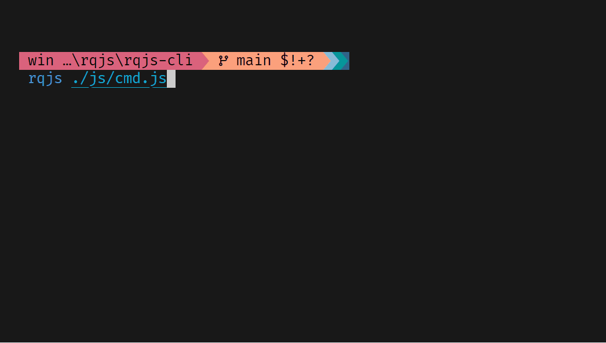

## rqjs-ext
Copy llrt source file, add some patch support windows
```bash

```


## rqjs-cli

```bash
rqjs ./a.js
```


## example

### [cmd](https://github.com/ahaoboy/r-tui/blob/main/ui/src/examples/cmd.tsx)
